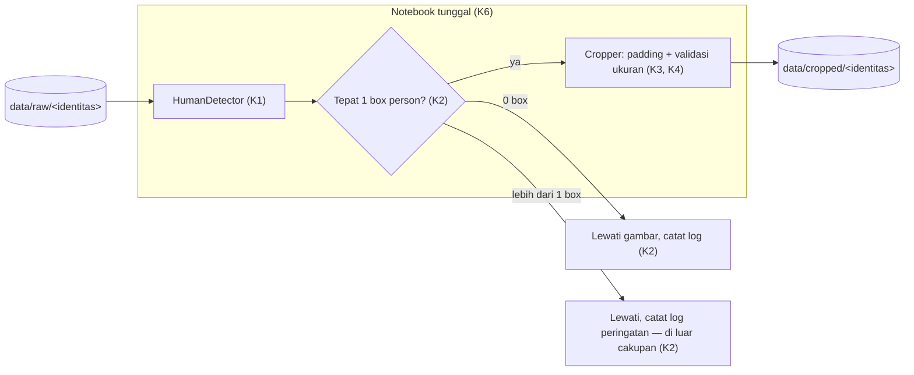

# 001a · MVP · Deteksi manusia dan cropping identitas

Disetujui: 2026-09-26
Produk: Deteksi Manusia & Cropping untuk Persiapan Data Identitas · Jenis: Data pipeline (persiapan dataset untuk fine-tuning LoRA identitas) · Data: tingkat 0, mode data rahasia tidak aktif
Dasar: rancangan pertama, tidak ada nomor sebelumnya
Dokumen terkait: docs/keputusan-produk.md

## Diagram alur


## Yang dirancang atau diubah
Rancangan pertama. Bagian sistem yang dibangun:
- Struktur folder project: `notebooks/`, `data/raw/<identitas>/`, `data/cropped/<identitas>/`, `requirements.txt`, `README.md` (K6).
- Satu notebook (`notebooks/0_<nama proses>.ipynb`) berisi seluruh kode inti: config, `HumanDetector`, validasi jumlah deteksi, `Cropper`, orkestrasi per identitas (K6).
- `HumanDetector`: bungkus YOLOv8n (`ultralytics`), filter kelas `person`, kembalikan daftar bounding box + confidence (K1).
- Validasi jumlah deteksi: memastikan tepat satu box per gambar; 0 box → lewati & log; lebih dari 1 box → lewati & log peringatan, di luar cakupan MVP (K2).
- `Cropper`: potong region sesuai box + padding rasio 0.1; tolak & log crop di bawah ukuran minimum (K3, K4).
- Orkestrasi: jalankan alur di atas per identitas dari `data/raw/<identitas>/` ke `data/cropped/<identitas>/`, nama file hasil diturunkan dari nama file asal agar re-run aman (K5).

Tidak dibangun di rancangan ini: pemilihan subjek utama dari banyak orang, face alignment, deduplikasi, quality filtering, pemisahan kode ke modul `.py`, penyediaan/pengujian data sungguhan (lihat "Ditunda" di `docs/keputusan-produk.md`).

## Rincian engineering

```
K1 · YOLOv8n person detection — Umum [S1, S2]
Pendekatan   Model pretrained COCO `yolov8n.pt` via package `ultralytics`,
             inference memakai filter classes=[0] (kelas "person")
Parameter    conf_threshold = 0.5 (sementara — dari draft, belum dikalibrasi
             pada data asli)
Kenapa       Sesuai permintaan prompt; nano model cukup ringan untuk CPU
Lisensi      AGPL-3.0 (default paket ultralytics) — dipakai internal saja,
             tidak didistribusikan/dijual (keputusan titik periksa 2)
```

```
K2 · Validasi jumlah deteksi (bukan pemilihan subjek) — baru
Pendekatan   Untuk setiap gambar: hitung jumlah box "person" hasil
             HumanDetector.
             - jumlah == 1  → lanjut ke Cropper
             - jumlah == 0  → lewati gambar, catat log info
             - jumlah  > 1  → lewati gambar, catat log peringatan
                               (dianggap di luar cakupan MVP)
Kenapa       Cakupan MVP disederhanakan ke "1 orang per foto" (keputusan
             Arya, titik periksa 1); tidak ada heuristik pemilihan box
             otomatis di antara banyak orang
Metrik       Tidak ada gate otomatis di MVP ini — Arya memeriksa sendiri
             berapa foto yang terlewat lewat log saat menjalankan pipeline
```

```
K3 · Validasi ukuran minimum crop — Umum (pengetahuan umum)
Pendekatan   Setelah crop dipotong, cek sisi terpanjang (max(width, height)
             dari region hasil crop)
Parameter    min_side_px = nilai awal sementara, disarankan mulai dari 64px,
             dikalibrasi ulang oleh Arya setelah melihat distribusi ukuran
             foto asli
Kenapa       Mencegah crop terlalu kecil/blur ikut menjadi data training
```

```
K4 · Padding crop — dipertahankan dari draft
Pendekatan   Padding simetris di keempat sisi bounding box sebelum crop
Parameter    padding_ratio = 0.1 (dari draft `00_name_file.ipynb`)
Kenapa       Sudah pernah dicoba di draft, cukup untuk MVP; penyeragaman
             aspek rasio (square) didorong ke tahap alignment berikutnya
```

```
K5 · Re-run aman — Umum (pengetahuan umum pipeline data)
Pendekatan   Nama file hasil crop diturunkan dari nama file gambar asal,
             mis. `<nama_asli>_person.jpg`, bukan penomoran urut/acak
Kenapa       Menjalankan ulang pipeline pada data yang sama menimpa file
             lama, bukan menduplikasi — aturan wajib pipeline data
```

```
K6 · Struktur proyek — folder dirancang sekarang, kode satu notebook
Struktur folder
             identity-lora-pipeline/
             ├── notebooks/0_<nama proses>.ipynb
             ├── data/raw/<identitas>/
             ├── data/cropped/<identitas>/
             ├── requirements.txt
             └── README.md
Struktur kode
             Semua kelas dan fungsi (HumanDetector, validasi jumlah
             deteksi, Cropper, orkestrasi) ditulis di dalam satu notebook,
             tidak dipecah jadi file .py di fase ini
Kenapa       Keputusan Arya, titik periksa 4: kecepatan MVP diutamakan;
             pemisahan modul ditunda ke fase Dev
Catatan      Bobot model (yolov8n.pt) memakai cache unduhan bawaan
             ultralytics; tidak ada .env karena tidak ada kredensial/API
             key yang dipakai
```

Alternatif yang ditolak:

| Pendekatan | Ditolak karena |
|---|---|
| Pemilihan subjek utama otomatis (area terbesar / confidence tertinggi) saat >1 box | Arya menyederhanakan cakupan MVP menjadi "hanya 1 orang per foto"; kasus >1 box dianggap di luar cakupan, bukan diselesaikan otomatis |
| Menyimpan semua box seperti draft lama (`process_identity` crop semua deteksi) | Mencemari dataset identitas dengan foto orang lain di latar |
| Data pengganti publik (bus.jpg, zidane.jpg dari `ultralytics/assets`) untuk uji mekanik | Arya memilih menguji sendiri dengan data miliknya; penyediaan data uji di luar cakupan pekerjaan pink-chan |
| Modul Python terpisah (`shared/`, `detect/`, `crop/`) sejak MVP | Arya memilih semua kode tetap satu notebook untuk MVP; pemisahan ditunda ke fase Dev |
| Enterprise License Ultralytics | Tidak diperlukan selama pipeline dipakai internal saja, tidak didistribusikan/dijual |

## Laporan rancangan

```
Produk: Data pipeline — modul deteksi manusia (YOLOv8n) dan cropping untuk persiapan dataset identitas LoRA
Fase: MVP
Status: siap dikerjakan (setelah 4 titik periksa dijawab Arya)

Gambaran sistem:
[data/raw/<identitas>]
        │
        ▼
HumanDetector (K1) — YOLOv8n, kelas "person", conf 0.5
        │  daftar bounding box + confidence
        ▼
Validasi jumlah deteksi (K2) — harus tepat 1 box
        │ tepat 1          │ 0 box            │ >1 box
        ▼                  ▼                  ▼
   Cropper (K3, K4)   lewati + log      lewati + log peringatan
        │                                (di luar cakupan MVP)
        ▼
[data/cropped/<identitas>]  →  dipakai notebook alignment berikutnya

Seluruh kode (HumanDetector, validasi jumlah deteksi, Cropper, orkestrasi)
ditulis dalam satu notebook (K6). Struktur folder: notebooks/, data/raw/,
data/cropped/, requirements.txt, README.md.

Keputusan:
- D1 Pengguna → Arya dan pink-chan (internal, developer).
- D2 Cakupan → deteksi + validasi tepat-satu-box + cropping per identitas.
  MVP hanya menangani foto berisi 1 orang; foto 0 atau >1 orang dilewati.
- D3 Sumber data → folder lokal per identitas disediakan Arya nanti;
  penyediaan/pengujian data sungguhan di luar cakupan rancangan ini.
- D4 Tanda berhasil → modul bisa diimpor tanpa error, struktur sesuai
  rancangan; tidak disyaratkan menjalankan pipeline pada data sungguhan.
- K1 Model deteksi → YOLOv8n pretrained COCO via `ultralytics`, kelas
  person (id 0), confidence 0.5 (sementara) [Umum, S1, S2]. Lisensi
  AGPL-3.0, dipakai internal saja.
- K2 Validasi jumlah deteksi → tepat 1 box diproses; 0 box dilewati+log;
  >1 box dilewati+log peringatan (di luar cakupan), tidak ada pemilihan
  subjek otomatis.
- K3 Validasi ukuran minimum crop → tolak crop di bawah ambang piksel
  (sementara) [Umum].
- K4 Padding crop → rasio 0.1, dipertahankan dari draft.
- K5 Re-run aman → nama file crop diturunkan dari nama file asal [Umum].
- K6 Struktur proyek → folder dirancang sekarang (notebooks/, data/raw/,
  data/cropped/, requirements.txt, README.md); kode tetap satu notebook
  di fase MVP, pemisahan modul ditunda ke Dev.

Desain UI/UX: tidak berlaku — tidak ada antarmuka pengguna akhir.
Model data: tidak berlaku — hasil disimpan sebagai file gambar di sistem
berkas, bukan data terstruktur di basis data.

Bentrokan:
- Cakupan "hanya 1 orang per foto" vs foto asli yang mungkin memuat >1
  orang → foto seperti itu dilewati dan dicatat, bukan diproses otomatis.
- Ambang confidence tetap (0.5) vs variasi pose/jarak kamera foto asli
  yang belum diketahui → ditandai (sementara), dikalibrasi Arya sendiri.
- Tanda berhasil berbasis validasi statis vs belum ada bukti pipeline
  berjalan pada gambar sungguhan → diterima sebagai keputusan Arya;
  pengujian nyata dilakukan Arya sendiri di luar rancangan ini.

Asumsi:
- Foto identitas asli sudah dikurasi berisi satu orang dominan per foto.
- Tidak ada batasan GPU; YOLOv8n cukup ringan untuk CPU laptop Arya.
- Pipeline dijalankan manual per identitas, belum ada penjadwalan otomatis.
- "red-chan"/"pink-chan" di draft notebook adalah nama identitas uji coba,
  bukan data rahasia klien.
- Pipeline dipakai internal saja, tidak didistribusikan/dijual.

Riset: 2 pencarian, 3 halaman dibaca (docs.ultralytics.com/models/yolov8;
ultralytics.com/legal/agpl-3-0-software-license + LICENSE GitHub;
github.com/ultralytics/assets). Sumber dilarang yang dilewati: 0.
```

## Titik periksa dan pilihan Arya
1. [Subjek] Pemilihan bounding box saat >1 orang terdeteksi.
   a. Satu box, area terbesar — tidak dipilih.
   b. Satu box, confidence tertinggi — tidak dipilih.
   c. Simpan semua box (draft lama) — tidak dipilih.
   d. Cakupan MVP disederhanakan: hanya foto 1 orang; 0 box → lewati+log; >1 box → di luar cakupan, lewati+log peringatan. ✓ 2026-09-26 (jawaban Arya, di luar pilihan a/b/c)

2. [Lisensi] Status pemakaian pipeline terhadap lisensi AGPL-3.0.
   a. Internal saja, tidak didistribusikan/dijual. ✓ 2026-09-26
   b. Ditawarkan sebagai layanan/produk ke pihak lain — tidak dipilih.
   c. Belum tahu, ditunda — tidak dipilih.

3. [DataUji] Data pengganti untuk uji mekanik pipeline sebelum data asli tersedia.
   a. Gambar demo resmi Ultralytics (bus.jpg, zidane.jpg) — tidak dipilih.
   b. Arya menyiapkan foto pribadi non-rahasia sendiri — tidak dipilih.
   c. Tunda pengujian sampai data asli datang — tidak dipilih.
   d. Pengujian dengan data sungguhan dilakukan Arya sendiri, di luar cakupan rancangan; codebase hanya divalidasi statis/impor. ✓ 2026-09-26 (jawaban Arya, di luar pilihan a/b/c)

4. [Struktur] Pemisahan kode inti ke modul Python sejak MVP atau tetap satu notebook.
   a. Modul Python (`shared`, `detect`, `crop`) dipanggil dari notebook — tidak dipilih.
   b. Semua kode tetap di satu notebook, dipisah nanti di fase Dev. ✓ 2026-09-26

## Koreksi selama putaran
- Titik periksa 1: cakupan disederhanakan menjadi "hanya foto 1 orang"; K2 diubah dari heuristik pemilihan subjek menjadi validasi jumlah deteksi (0/1/>1).
- Titik periksa 2: usulan "internal saja" disetujui tanpa perubahan.
- Titik periksa 3: penyediaan dan pengujian data uji dikeluarkan dari cakupan rancangan dan pekerjaan pink-chan; D4 (tanda berhasil) diubah menjadi validasi statis/impor saja, tidak menjalankan pipeline pada data sungguhan.
- Titik periksa 4: usulan modul Python terpisah ditolak; K6 diubah menjadi kode tetap satu notebook untuk fase MVP, struktur folder tetap dirancang terpisah dari struktur kode.

## Perintah untuk pink-chan
pink-chan, susun rencana pembangunan dari docs/rancangan/001a_2026-09-26_mvp-deteksi-manusia-dan-cropping.md
