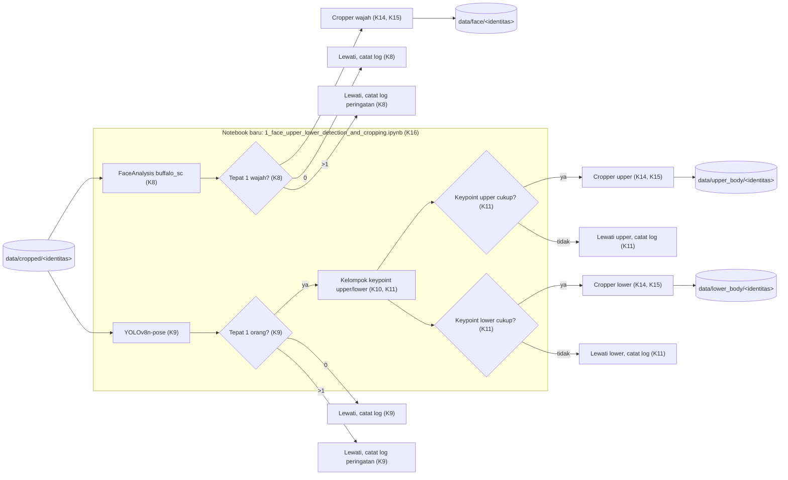

# 002a · MVP · Deteksi wajah, upper body, lower body dan cropping

Disetujui: 2026-09-26
Produk: Deteksi Manusia, Wajah, dan Bagian Tubuh & Cropping untuk Persiapan Data Identitas · Jenis: Data pipeline (persiapan dataset untuk fine-tuning LoRA identitas) · Data: tingkat 0, mode data rahasia tidak aktif
Dasar: 001a (Deteksi manusia dan cropping identitas) — modul 002 membaca output modul 001, tidak mengubah keputusan K1–K6 di 001a
Dokumen terkait: docs/keputusan-produk.md

## Diagram alur


## Yang dirancang atau diubah
Rancangan baru, lanjutan pipeline setelah modul 001 (dasar: 001a). Bagian sistem yang dibangun:
- Notebook baru `notebooks/1_face_upper_lower_detection_and_cropping.ipynb`, satu file, functional (config konstanta, error class, logger, tanpa OOP) — konsisten gaya notebook 0 (K16).
- Deteksi wajah: bungkus `insightface.app.FaceAnalysis(name="buffalo_sc", allowed_modules=["detection"])`, validasi tepat-1-wajah (K8).
- Deteksi pose: bungkus `YOLO("yolov8n-pose.pt")`, kembalikan 17 keypoint COCO per orang, validasi tepat-1-orang (K9).
- Pengelompokan keypoint upper/lower dan penurunan bbox dari titik yang lolos ambang confidence (K10, K11).
- Cropper untuk ketiga jenis bbox (wajah, upper, lower): reuse pola padding + validasi ukuran minimum dari modul 001, hanya sumber bbox yang berbeda (K14, K15).
- Orkestrasi: jalankan seluruh alur di atas per identitas dari `data/cropped/<identitas>/` (output modul 001) ke `data/face/<identitas>/`, `data/upper_body/<identitas>/`, `data/lower_body/<identitas>/`, independen per jenis deteksi (K12), struktur folder output baru (K13).

Tidak berubah dari modul 001: K1–K6 (deteksi manusia YOLOv8n, validasi tepat-1-box, padding, ukuran minimum, re-run aman, struktur notebook 0) tetap seperti di 001a — tidak disentuh rancangan ini.

Tidak dibangun di rancangan ini: manifest/pencocokan triplet crop lengkap per foto, kalibrasi ambang pada data asli, pengujian dengan data sungguhan, alignment lanjutan, penggantian model deteksi wajah (lihat "Ditunda" di `docs/keputusan-produk.md`).

## Rincian engineering

```
K7 · Sumber input modul 002 — keputusan Arya titik periksa 5
Pendekatan   Baca gambar dari data/cropped/<identitas>/ (output modul 001),
             bukan data/raw/<identitas>/ langsung
Kenapa       Reuse invarian "tepat 1 orang per foto" yang sudah divalidasi
             modul 001; gambar lebih bersih dari background/orang lain
Konsekuensi  Modul 002 hanya bisa dijalankan setelah modul 001 selesai
             untuk identitas yang sama (dependency antar notebook)
```

```
K8 · Deteksi wajah — InsightFace FaceAnalysis buffalo_sc — Naik [S4, S5]
Pendekatan   app = FaceAnalysis(name="buffalo_sc",
                                 allowed_modules=["detection"])
             app.prepare(ctx_id=-1, det_thresh=0.5)
             faces = app.get(image)  # list of face, tiap face punya .bbox
Parameter    det_thresh = 0.5 (sementara, belum dikalibrasi pada data asli)
Validasi     len(faces) == 1  → lanjut ke Cropper wajah
             len(faces) == 0  → lewati, catat log info
             len(faces)  > 1  → lewati, catat log peringatan (di luar cakupan)
Kenapa       allowed_modules=["detection"] membatasi hanya memuat model
             deteksi SCRFD-500MF; model recognition MBF@WebFace600K yang
             ikut di pack buffalo_sc tidak dipakai dan tidak perlu dimuat
Lisensi      Kode insightface: MIT. Model buffalo_sc: non-commercial
             research only — dipakai internal saja (keputusan Arya,
             titik periksa 6), risiko ditinjau ulang kalau model bisnis
             pipeline ini (atau LoRA hasilnya) berubah menjadi komersial
```

```
K9 · Deteksi pose — YOLOv8n-pose — Umum [S1, S2, S6, S7]
Pendekatan   model = YOLO("yolov8n-pose.pt")
             results = model.predict(source=image_path, conf=POSE_CONF_
                                      THRESHOLD, verbose=False)
             keypoints = results[0].keypoints.data  # shape (N, 17, 3)
Parameter    POSE_CONF_THRESHOLD = 0.5 (sementara, konstanta terpisah dari
             K11 KEYPOINT_CONF_THRESHOLD supaya tidak tertukar maknanya)
Validasi     N == 1  → lanjut ke pengelompokan keypoint (K10)
             N == 0  → lewati, catat log info
             N  > 1  → lewati, catat log peringatan (di luar cakupan)
Lisensi      AGPL-3.0 (paket ultralytics yang sama dengan K1) — dipakai
             internal saja, mewarisi keputusan Arya di titik periksa 2
             modul 001 (tidak diulang sebagai titik periksa baru)
```

```
K10 · Kelompok keypoint & bbox — baru (pengetahuan umum computer vision)
Pendekatan   17 keypoint COCO (indeks 0–16, urutan dari S7):
             0 nose, 1 left_eye, 2 right_eye, 3 left_ear, 4 right_ear,
             5 left_shoulder, 6 right_shoulder, 7 left_elbow, 8 right_elbow,
             9 left_wrist, 10 right_wrist, 11 left_hip, 12 right_hip,
             13 left_knee, 14 right_knee, 15 left_ankle, 16 right_ankle

             UPPER_KEYPOINT_INDICES = {0..10}   (kepala, bahu, siku, tangan)
             LOWER_KEYPOINT_INDICES = {11..16}  (pinggul, lutut, mata kaki)

             Untuk satu grup: ambil titik dengan confidence ≥
             KEYPOINT_CONF_THRESHOLD (K11), lalu
                 x1 = min(x titik lolos),  x2 = max(x titik lolos)
                 y1 = min(y titik lolos),  y2 = max(y titik lolos)
             bbox grup = (x1, y1, x2, y2), lalu diberi padding (K14)
Kenapa       Pembagian di garis pinggul mengikuti konvensi umum
             "upper garment vs lower garment" pada crop tubuh untuk
             kebutuhan data latih LoRA per-region; bukan dari paper
             pose-estimation spesifik
```

```
K11 · Penanganan keypoint tidak lengkap — keputusan Arya titik periksa 8
Pendekatan   Grup (upper/lower) valid untuk di-crop kalau DUA syarat
             terpenuhi:
             (a) minimal satu titik "anchor" grup itu confidence ≥
                 KEYPOINT_CONF_THRESHOLD
                   anchor upper = {left_shoulder, right_shoulder}
                   anchor lower = {left_hip, right_hip}
             (b) minimal 2 titik total dari grup itu confidence ≥
                 KEYPOINT_CONF_THRESHOLD
Parameter    KEYPOINT_CONF_THRESHOLD = 0.5 (sementara, dikalibrasi Arya
             sendiri nanti; konstanta terpisah dari K9 POSE_CONF_THRESHOLD)
Kalau tidak
terpenuhi    Lewati jenis itu (upper atau lower) untuk gambar tersebut,
             catat log info; jenis lain tetap diproses (lihat K12)
Kenapa       Menjaga kualitas box, menghindari bbox yang dihitung dari
             1 titik saja yang tidak representatif ukuran tubuhnya
```

```
K12 · Cakupan per jenis deteksi — keputusan Arya titik periksa 7
Pendekatan   Face, upper, lower diproses independen per gambar. Satu
             gambar bisa menghasilkan 0 sampai 3 crop. Kalau satu jenis
             gagal (0/lebih dari 1 deteksi, atau keypoint tidak cukup),
             jenis itu dilewati+log, jenis lain yang berhasil tetap
             disimpan — tidak ada gate "semua jenis harus berhasil"
Kenapa       Lebih banyak data terselamatkan dibanding gate ketat;
             risiko crop tidak berpasangan (triplet tidak lengkap per
             foto) diterima dan didorong ke Ditunda kalau perlu dirapikan
             saat tahap training LoRA membutuhkan set lengkap
```

```
K13 · Struktur folder output — baru
Struktur     data/face/<identitas>/
             data/upper_body/<identitas>/
             data/lower_body/<identitas>/
Kenapa       Sengaja TIDAK bersarang di bawah data/cropped/ (yang sudah
             dipakai modul 001 sebagai output, dan kini juga jadi INPUT
             modul 002) — menghindari ambiguitas "cropped di dalam
             cropped"; folder baru dipisah di level yang sama
```

```
K14 · Padding & ukuran minimum crop modul 002 — reuse K3/K4, Umum
Pendekatan   Reuse bentuk BoundingBox dan fungsi crop+padding+validasi
             ukuran yang sama dengan modul 001, dipanggil ulang untuk
             tiga sumber bbox berbeda (wajah dari K8, upper/lower dari
             K10/K11)
Parameter    PADDING_RATIO = 0.1 (sama dengan K4)
             MIN_SIDE_PX = 64 (sama dengan K3, sementara)
Kenapa       Konsistensi dengan modul 001; menghindari duplikasi logika
             crop untuk tiga jenis bbox yang berbeda sumbernya
```

```
K15 · Re-run aman modul 002 — reuse pola K5, Umum
Pendekatan   Nama file hasil crop diturunkan dari nama file sumber:
             <nama_asli>_face.jpg, <nama_asli>_upper.jpg,
             <nama_asli>_lower.jpg
Kenapa       Menjalankan ulang pipeline pada data yang sama menimpa file
             lama, bukan menduplikasi — sama seperti K5 modul 001
```

```
K16 · Struktur kode modul 002 — konsisten K6
Struktur     notebooks/1_face_upper_lower_detection_and_cropping.ipynb —
             satu notebook baru, functional (config konstanta, error
             class per kegagalan, logger, tanpa OOP), tidak dipecah jadi
             file .py di fase ini
Kenapa       Keputusan Arya (konsisten titik periksa 4 modul 001):
             kecepatan MVP diutamakan; pemisahan modul Python ditunda ke
             fase Dev untuk seluruh pipeline sekaligus, bukan per modul
```

Alternatif yang ditolak:

| Pendekatan | Ditolak karena |
|---|---|
| Modul 002 membaca `data/raw/<identitas>/` langsung, independen dari modul 001 | Arya memilih reuse invarian "1 orang per foto" dari modul 001 (titik periksa 5); mengulang validasi jumlah orang dianggap tidak perlu |
| Ganti model deteksi wajah ke yang berlisensi lebih aman untuk kemungkinan komersial (mis. RetinaFace) | Arya memilih tetap `buffalo_sc` sesuai permintaan eksplisit, dipakai internal saja (titik periksa 6) |
| Semua jenis deteksi (face/upper/lower) harus berhasil dulu sebelum satu pun disimpan | Arya memilih independen per jenis (titik periksa 7): lebih banyak data terselamatkan meski berisiko crop tidak berpasangan |
| Bbox upper/lower dihitung dari titik apa pun yang tersedia (minimal 1 titik) | Arya memilih syarat anchor + minimal 2 titik (titik periksa 8): menjaga kualitas box |
| Folder output bersarang di `data/cropped/face/`, `data/cropped/upper_body/`, dst. | Ambigu dengan `data/cropped/<identitas>/` yang sudah dipakai modul 001 sebagai output dan kini jadi input modul 002; dipisah jadi `data/face/`, dst. (K13) |

## Laporan rancangan

```
Produk: Data pipeline — modul deteksi wajah, upper body, lower body
(YOLOv8n-pose + InsightFace buffalo_sc) dan cropping-nya, lanjutan pipeline
persiapan data identitas LoRA
Fase: MVP
Status: siap dikerjakan (setelah 4 titik periksa dijawab Arya)
Dasar: 001a (Deteksi manusia dan cropping identitas)

Gambaran sistem:
[data/cropped/<identitas>]  (hasil modul 001 — sumber input, K7)
        │
        ├────────────────────────────┬───────────────────────────
        ▼                            ▼
FaceAnalysis buffalo_sc (K8)     YOLOv8n-pose (K9)
  deteksi wajah                   deteksi orang + 17 keypoint COCO
        │                              │
  tepat 1 wajah?                 tepat 1 orang?
  ya │   0 │   >1 │              ya │   0 │   >1 │
     ▼     ▼      ▼                 ▼     ▼      ▼
   crop   skip   skip+log      kelompok  skip   skip+log
   wajah  +log   peringatan    keypoint  +log   peringatan
     │                         upper/lower (K10, K11)
     ▼                              │          │
[data/face/<identitas>]             ▼          ▼
                              crop upper   crop lower
                              (K14)        (K14)
                                 │            │
                                 ▼            ▼
                        [data/upper_body/  [data/lower_body/
                         <identitas>]       <identitas>]

Tiap jenis deteksi berjalan independen per gambar (K12); satu notebook
baru (K16), fungsi murni, mengikuti gaya notebook 0.

Keputusan:
- D1 Pengguna → sama seperti modul 001: Arya dan pink-chan (internal).
- D2 Cakupan → diperluas: deteksi wajah, upper body, lower body + cropping
  masing-masing, dari data/cropped/<identitas>/ ke tiga folder baru.
  K1–K6 modul 001 tidak diubah.
- D3 Sumber data → sumber langsung modul ini adalah output modul 001,
  bukan data/raw/ (titik periksa 5).
- D4 Tanda berhasil → mewarisi pola 001: validasi statis/impor saja.
- K7 Sumber input → data/cropped/<identitas>/ hasil modul 001.
- K8 Deteksi wajah → FaceAnalysis(name="buffalo_sc",
  allowed_modules=["detection"]), ctx_id=-1, det_thresh=0.5 (sementara),
  validasi tepat 1 wajah [Naik, S4, S5]. Lisensi model buffalo_sc:
  non-commercial research only, dipakai internal saja.
- K9 Deteksi pose → yolov8n-pose.pt via ultralytics, 17 keypoint COCO,
  validasi tepat 1 orang [Umum, S1, S2, S6, S7]. Lisensi AGPL-3.0,
  mewarisi keputusan titik periksa 2 modul 001.
- K10 Kelompok keypoint & bbox → upper = indeks 0-10, lower = indeks
  11-16, bbox dari min/max titik yang lolos ambang.
- K11 Penanganan keypoint tidak lengkap → anchor (bahu/pinggul) +
  minimal 2 titik per grup, kalau kurang → lewati jenis itu & log.
- K12 Cakupan per jenis deteksi → independen, satu jenis gagal tidak
  menggagalkan jenis lain.
- K13 Struktur folder output → data/face/, data/upper_body/,
  data/lower_body/ (tidak bersarang di bawah data/cropped/).
- K14 Padding & ukuran minimum → reuse PADDING_RATIO=0.1,
  MIN_SIDE_PX=64 dari modul 001 [Umum].
- K15 Re-run aman → nama file diturunkan dari nama asal, per jenis
  (_face/_upper/_lower) [Umum].
- K16 Struktur kode → notebook baru satu file, functional, konsisten K6.

Desain UI/UX: tidak berlaku — tidak ada antarmuka pengguna akhir.
Model data: tidak berlaku — hasil disimpan sebagai file gambar di sistem
berkas, bukan data terstruktur di basis data.

Bentrokan:
- Sumber input (data/cropped/) menambah dependency wajib ke modul 001 →
  diterima, dicatat di README urutan eksekusi notebook 0 lalu 1.
- Lisensi buffalo_sc non-commercial-research-only vs kemungkinan model
  bisnis LoRA komersial → dipakai internal saja untuk fase ini (titik
  periksa 6), ditinjau ulang kalau model bisnis berubah.
- Folder output baru vs data/cropped/ existing → dipisah di level yang
  sama (K13), tidak bersarang.
- Cakupan independen per jenis (K12) vs kebutuhan triplet lengkap untuk
  training LoRA berikutnya → diterima, pencocokan triplet didorong ke
  Ditunda kalau dibutuhkan.
- Dua ambang confidence berbeda makna (deteksi orang/wajah vs deteksi
  per-keypoint) → dipisah nama konstanta (POSE_CONF_THRESHOLD vs
  KEYPOINT_CONF_THRESHOLD) supaya tidak tertukar.

Asumsi:
- Foto input modul 002 sudah tervalidasi 1 orang oleh modul 001.
- Tidak ada GPU; ctx_id=-1 untuk InsightFace, model ringan (buffalo_sc
  16MB, yolov8n-pose.pt) dipilih sesuai kebutuhan CPU.
- Tujuan crop upper/lower body adalah data latih LoRA per-region, bbox
  sederhana dari keypoint sudah cukup untuk fase MVP ini.
- Pipeline dipakai internal saja; kalau model bisnis berubah, lisensi
  AGPL (YOLOv8n-pose) dan non-commercial buffalo_sc perlu ditinjau ulang.

Riset: 2 pencarian, 8 halaman dicoba dibaca (6 berhasil: model_zoo/README.md,
README.md, python-package/README.md — repo deepinsight/insightface;
docs/en/tasks/pose.md, cfg/datasets/coco-pose.yaml — repo ultralytics/
ultralytics, raw GitHub; 2 gagal diakses — docs.ultralytics.com diblokir
egress, satu raw file 404 — tidak dipakai sebagai dasar). Sumber dilarang
yang dilewati: 0.
```

## Titik periksa dan pilihan Arya
1. [Subjek] (modul 001, tidak diulang di sini) — lihat 001a.
2. [Lisensi] (modul 001, tidak diulang di sini) — lihat 001a.
3. [DataUji] (modul 001, tidak diulang di sini) — lihat 001a.
4. [Struktur] (modul 001, tidak diulang di sini) — lihat 001a.
5. [SumberInput] Sumber gambar modul 002: hasil modul 001 atau raw langsung.
   a. `data/cropped/<identitas>/` — hasil modul 001. ✓ 2026-09-26
   b. `data/raw/<identitas>/` — independen dari modul 001 — tidak dipilih.
6. [LisensiWajah] Status pemakaian model `buffalo_sc` (non-commercial research only).
   a. Internal saja, konsisten keputusan AGPL modul 001. ✓ 2026-09-26
   b. Ganti model deteksi wajah lain yang lebih aman untuk komersial — tidak dipilih.
   c. Belum tahu model bisnis akhir, ditunda — tidak dipilih.
7. [CakupanJenis] Kalau satu jenis deteksi gagal untuk satu foto.
   a. Independen per jenis: simpan yang berhasil, lewati yang gagal. ✓ 2026-09-26
   b. Semua jenis harus berhasil dulu, kalau satu gagal seluruh foto dilewati — tidak dipilih.
8. [Keypoint] Validitas bbox upper/lower saat keypoint tidak lengkap.
   a. Anchor (bahu/pinggul) + minimal 2 titik per grup. ✓ 2026-09-26
   b. Bbox dari titik apa pun yang tersedia (minimal 1 titik) — tidak dipilih.

## Koreksi selama putaran
Tidak ada — keempat titik periksa (5–8) disetujui Arya mengikuti usulan (pilihan a) tanpa perubahan.

## Perintah untuk pink-chan
pink-chan, susun rencana pembangunan dari docs/rancangan/002a_2026-09-26_mvp-deteksi-wajah-tubuh-dan-cropping.md
