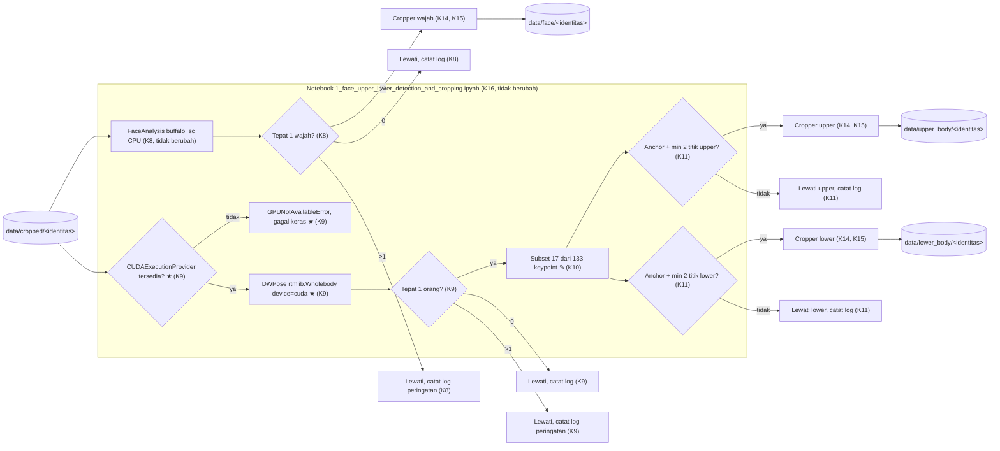

# 003a · MVP · Revisi deteksi pose ke DWPose (rtmlib) dengan GPU wajib

Disetujui: 2026-09-26
Produk: Deteksi Manusia, Wajah, dan Bagian Tubuh & Cropping untuk Persiapan Data Identitas · Jenis: Data pipeline (persiapan dataset untuk fine-tuning LoRA identitas) · Data: tingkat 0, mode data rahasia tidak aktif
Dasar: 002a (Deteksi wajah, upper body, lower body dan cropping) — merevisi K9, K10, K11; K7, K8, K12–K16 tidak berubah
Dokumen terkait: docs/keputusan-produk.md

## Diagram alur


## Yang dirancang atau diubah

Dibanding 002a sebelumnya:

| Jenis | Bagian / keputusan | Sebelumnya | Sekarang |
|---|---|---|---|
| Diubah | K9 Deteksi pose | `YOLO("yolov8n-pose.pt")` via `ultralytics`, CPU, 17 keypoint COCO, `POSE_CONF_THRESHOLD=0.5` | `rtmlib.Wholebody` (DWPose), `mode="balanced"`, `device="cuda"` **wajib** (verifikasi eksplisit `onnxruntime.get_available_providers()`, gagal keras `GPUNotAvailableError` kalau CUDA tidak tersedia — TIDAK fallback CPU), 133 keypoint whole-body (`keypoints`, `scores` terpisah) |
| Diubah | K10 Kelompok keypoint & bbox | Upper=0–10, Lower=11–16 dari 17 keypoint YOLOv8-pose | Upper=0–10, Lower=11–16 dari **subset** 133 keypoint DWPose (indeks tetap sama — 17 body pertama COCO-WholeBody identik urutannya dengan COCO 17-keypoint); 116 titik sisanya (6 feet, 68 face, 42 hand) diabaikan sepenuhnya |
| Ditinjau ulang, aturan tidak berubah | K11 Penanganan keypoint tidak lengkap | Anchor (bahu/pinggul) + min 2 titik, dari array `(17,3)` gabungan Ultralytics | Aturan identik; sumber data berubah ke dua array terpisah `keypoints`/`scores` dari `rtmlib`, digabung berdasarkan indeks sebelum aturan diterapkan |
| Baru (dependency) | requirements.txt | `ultralytics`, `onnxruntime==1.30.0`, dst. | Tambah `rtmlib`; ganti `onnxruntime==1.30.0` → `onnxruntime-gpu` (satu paket saja); `ultralytics` tetap ada (dipakai K1, modul 001); bobot `yolov8n-pose.pt` tidak lagi dipakai |
| Baru | Error class | — | `GPUNotAvailableError` di `00_pipeline_errors.ipynb`, dilempar K9 kalau `CUDAExecutionProvider` tidak tersedia |

Tidak berubah: D1–D4 (D4 tetap berlaku: validasi statis/impor saja, tidak menjalankan model sungguhan sebagai gate MVP), K1–K8 (deteksi manusia modul 001, deteksi wajah `buffalo_sc` CPU), K12–K16 (cakupan independen per jenis, struktur folder output, padding/ukuran minimum crop, re-run aman, struktur notebook satu file).

Tidak dibangun di rancangan ini: pemindahan K1/K8 ke GPU, pemakaian 116 keypoint tambahan DWPose (feet/wajah/tangan), kalibrasi ambang pada data asli, pengujian dengan data sungguhan (lihat "Ditunda" di `docs/keputusan-produk.md`).

## Rincian engineering

```
K9 · Deteksi pose — DWPose via rtmlib.Wholebody, GPU wajib — Naik
     [S8, S9, S10, S12]
Pendekatan   import onnxruntime as ort
             from rtmlib import Wholebody

             def load_pose_detector(mode: str) -> Wholebody:
                 available = ort.get_available_providers()
                 if "CUDAExecutionProvider" not in available:
                     raise GPUNotAvailableError(
                         f"CUDAExecutionProvider tidak tersedia, "
                         f"providers terdeteksi: {available}"
                     )
                 return Wholebody(mode=mode, backend="onnxruntime",
                                   device="cuda")

             keypoints, scores = wholebody(image)
             # keypoints: (N, 133, 2) — x, y per orang per titik
             # scores:    (N, 133)    — confidence per orang per titik
Parameter    POSE_MODE = "balanced" (trade-off akurasi/kecepatan bawaan
             rtmlib; "performance" tersedia kalau perlu akurasi lebih
             tinggi, "lightweight" kalau GPU ternyata kurang kuat)
Device       device="cuda" WAJIB — koreksi Arya menolak usulan awal
             fallback otomatis ke CPU. Verifikasi `CUDAExecutionProvider`
             dilakukan SEBELUM memuat model (bukan menunggu error dari
             onnxruntime saat inferensi), supaya errornya jelas dan
             terjadi di titik yang tepat
Validasi     N == 1  → lanjut ke pengelompokan keypoint (K10)
             N == 0  → lewati, catat log info
             N  > 1  → lewati, catat log peringatan (di luar cakupan,
                        sama seperti K9 lama)
Dependency   requirements.txt: tambah `rtmlib`; ganti
             `onnxruntime==1.30.0` → `onnxruntime-gpu` (SATU paket saja
             — memasang keduanya berisiko konflik binari yang sudah
             dikenal, karena dua-duanya mengekspos modul Python bernama
             sama `onnxruntime`). `onnxruntime-gpu` tetap menyediakan
             `CPUExecutionProvider`, jadi InsightFace K8 (`ctx_id=-1`,
             sengaja CPU) tidak terganggu. Paket `ultralytics` TETAP ada
             (masih dipakai modul 001/K1 untuk deteksi manusia, CPU) —
             hanya bobot `yolov8n-pose.pt` yang tidak lagi diunduh/dipakai
Konsekuensi  Notebook 1 TIDAK BISA divalidasi end-to-end (dijalankan
             sungguhan pada sel runner atau orkestrasi) di mesin tanpa
             GPU/CUDA — termasuk kemungkinan mesin pink-chan sendiri saat
             membangun kode. D4 (tanda berhasil = validasi statis/impor
             saja) tetap terpenuhi karena definisi fungsi tidak memanggil
             model saat diimpor; hanya sel runner (manual-run) dan
             pemakaian sungguhan yang akan melempar `GPUNotAvailableError`
             kalau dijalankan tanpa CUDA — diterima sebagai konsekuensi
             sadar keputusan Arya (titik periksa 10), bukan bug
Lisensi      Kode rtmlib: Apache-2.0 (aman). Kode DWPose (IDEA-Research,
             branch onnx, LICENSE mengatasnamakan IDEA 2023 & OpenMMLab
             2018-2020): Apache-2.0 (aman). Bobot model DWPose diunduh
             rtmlib dari mirror OpenMMLab/HuggingFace (Tau-J/RTMPose) —
             TIDAK ditemukan pernyataan lisensi terpisah untuk file bobot
             seperti "non-commercial" pada buffalo_sc (K8); dicatat di
             Belum pasti untuk verifikasi ulang kalau model bisnis
             berubah
```

Alternatif yang ditolak:

| Pendekatan | Ditolak karena |
|---|---|
| `IDEA-Research/DWPose` resmi + `mmpose`/`mmdet`/`mmcv` langsung | Instalasi jauh lebih berat (tiga paket besar, riwayat konflik versi antar rilis mmcv/mmdet/mmpose), butuh setup detector (YOLOX) terpisah secara manual — berlebihan untuk pipeline data sederhana ini |
| `controlnet_aux` (Hugging Face) `DWposeDetector` | Didukung organisasi besar (kelompok A), tapi dibuat untuk pipeline ControlNet/diffusers; menambah dependency `torch`/`diffusers` yang tidak dibutuhkan pipeline ini, keluaran diarahkan ke pose-map image, bukan array keypoint mentah yang langsung cocok dengan K10/K11 |
| GPU dengan fallback otomatis ke CPU (usulan awal red-chan) | Arya menolak: risiko pipeline "diam-diam" berjalan lebih lambat di CPU tanpa disadari; Arya memilih gagal keras dengan error jelas supaya masalah device terlihat segera (titik periksa 10) |
| Tetap YOLOv8n-pose, hanya pindahkan device ke GPU (`model.to("cuda")`) | Tidak memenuhi permintaan eksplisit Arya memakai model DWPose; hanya mengganti device tanpa mengganti model |

## Laporan rancangan

```
Produk: Data pipeline — revisi model deteksi pose (upper/lower body) di
modul 002, dari YOLOv8n-pose (CPU) ke DWPose via rtmlib (GPU wajib)
Fase: MVP
Status: siap dikerjakan (setelah 4 titik periksa dijawab Arya)
Dasar: 002a (Deteksi wajah, upper body, lower body dan cropping)

Gambaran sistem:
[data/cropped/<identitas>]  (hasil modul 001, tidak berubah — K7)
        │
        ├───────────────────────────┬────────────────────────────────
        ▼                           ▼
FaceAnalysis buffalo_sc (K8)    DWPose via rtmlib (K9)
  deteksi wajah, CPU               CUDAExecutionProvider wajib, gagal
  tidak berubah                    keras (GPUNotAvailableError) kalau
        │                          tidak ada; 1 panggilan end-to-end
  tepat 1 wajah?                        │
  ya│  0 │  >1 │                   tepat 1 orang? (N dari keypoints)
    ▼    ▼     ▼                   ya│  0 │  >1 │
  crop  skip  skip+log               ▼    ▼     ▼
  wajah +log  peringatan       subset indeks 0-16   skip  skip+log
    │                          dari 133 kp (K10)     +log  peringatan
    ▼                          (feet/wajah/tangan diabaikan)
[data/face/<identitas>]              │
                               anchor+min2 titik (K11, aturan sama)
                                       │            │
                                       ▼            ▼
                                 crop upper     crop lower
                                 (K14, tidak berubah)
                                       │              │
                                       ▼              ▼
                              [data/upper_body/   [data/lower_body/
                               <identitas>]         <identitas>]

Keputusan:
- D1–D4 tidak berubah (D4: validasi statis/impor tetap gate MVP; sel
  runner K9 akan gagal keras tanpa GPU, diterima sebagai konsekuensi
  sadar).
- K9 Deteksi pose → rtmlib.Wholebody (DWPose), mode="balanced",
  device="cuda" WAJIB — verifikasi eksplisit onnxruntime.get_available_
  providers() sebelum memuat model, raise GPUNotAvailableError kalau
  CUDAExecutionProvider tidak ada (koreksi Arya, menolak usulan fallback
  CPU) [Naik, S8, S9, S10, S12].
- K10 Kelompok keypoint & bbox → subset indeks 0-16 dari 133 keypoint
  DWPose (indeks upper/lower TIDAK berubah dari rancangan 002); 116
  titik feet/face/hand diabaikan sepenuhnya [S10, S11].
- K11 Penanganan keypoint tidak lengkap → aturan anchor+min-2-titik
  TIDAK berubah, hanya sumber array keypoint/scores yang berbeda.
- Requirements.txt → tambah rtmlib; ganti onnxruntime → onnxruntime-gpu
  (satu paket); ultralytics tetap ada (K1); tambah error class
  GPUNotAvailableError.
- K1 (deteksi manusia) dan K8 (deteksi wajah) tetap CPU, tidak diubah.

Desain UI/UX: tidak berlaku — tidak ada antarmuka pengguna akhir.
Model data: tidak berlaku — hasil disimpan sebagai file gambar di sistem
berkas, bukan data terstruktur di basis data.

Bentrokan:
- GPU wajib (K9) vs D4 tanda berhasil (validasi statis/impor saja) →
  definisi fungsi tidak memanggil model saat diimpor, jadi validasi
  statis pink-chan tetap lolos tanpa GPU; hanya sel runner/pemakaian
  sungguhan yang gagal keras tanpa CUDA — diterima sebagai keputusan
  sadar Arya.
- onnxruntime (K8) vs onnxruntime-gpu (K9) — dua paket berbagi nama
  modul yang sama, berisiko konflik binari → requirements.txt hanya
  memasang SATU paket (onnxruntime-gpu, tetap menyediakan
  CPUExecutionProvider untuk K8).
- Model DWPose (mode="balanced") relatif lebih berat dari YOLOv8n-pose
  lama; kalau GPU tidak tersedia, pipeline sengaja gagal keras (bukan
  lambat diam-diam) — konsekuensi eksplisit titik periksa 10.
- 133 keypoint DWPose mencakup 68 titik wajah — tumpang tindih konsep
  dengan K8 → titik wajah/tangan/kaki diabaikan sepenuhnya (K10, titik
  periksa 12), K8 tetap satu-satunya sumber crop wajah.
- Lisensi bobot model DWPose belum terverifikasi eksplisit terpisah
  dari lisensi kode (tidak seperti buffalo_sc) → dicatat di Belum
  pasti, ditinjau ulang kalau model bisnis berubah.

Asumsi:
- GPU (CUDA) diasumsikan akan tersedia di lingkungan tempat notebook
  akhirnya dijalankan Arya — berbeda dari asumsi lama "tidak ada GPU"
  modul 001/002; kalau ternyata tidak ada, pipeline sengaja gagal
  keras (GPUNotAvailableError), bukan gagal diam-diam ke CPU.
- mode="balanced" DWPose cukup untuk kebutuhan bbox upper/lower body
  sederhana (bukan riset pose presisi) — sejalan dengan asumsi lama.
- Environment Python project kompatibel dengan rtmlib (mensyaratkan
  Python >=3.10 per PyPI) — belum diverifikasi terhadap versi Python
  project ini, dicatat sebagai pemeriksaan teknis untuk pink-chan.
- K1 (modul 001) dan K8 (deteksi wajah) tetap CPU kecuali Arya secara
  eksplisit meminta lain (titik periksa 11) — permintaan Arya hanya
  menyebut "upper/lower body" (K9).

Riset: 9 pencarian, 12 halaman dicoba dibaca (10 berhasil: GitHub
Tau-J/rtmlib README x2, PyPI rtmlib, GitHub IDEA-Research/DWPose README
+ LICENSE branch onnx, GitHub jin-s13/COCO-WholeBody, hasil pencarian
GitHub open-mmlab/mmpose projects/rtmpose; 2 gagal diakses — rtmlib/docs/
model_zoo.md dan raw file backend onnxruntime.py, keduanya 404, tidak
dipakai sebagai dasar). Sumber dilarang yang dilewati: 3 (artikel
Civitai.com tentang DWPose/onnxruntime-gpu muncul di hasil pencarian,
tidak dipakai — bukan sumber layak per aturan riset).
```

## Titik periksa dan pilihan Arya
1. [Subjek] (modul 001, tidak diulang di sini) — lihat 001a.
2. [Lisensi] (modul 001, tidak diulang di sini) — lihat 001a.
3. [DataUji] (modul 001, tidak diulang di sini) — lihat 001a.
4. [Struktur] (modul 001, tidak diulang di sini) — lihat 001a.
5–8. [SumberInput/LisensiWajah/CakupanJenis/Keypoint] (modul 002, tidak diulang di sini) — lihat 002a.
9. [PaketDW] Paket implementasi DWPose.
   a. `rtmlib` (Wholebody class). ✓ 2026-09-26
   b. DWPose resmi + mmpose/mmdet/mmcv — tidak dipilih.
   c. `controlnet_aux` (Hugging Face) — tidak dipilih.
10. [DeviceGPU] Kalau GPU/CUDA tidak tersedia.
    a. GPU dengan fallback otomatis ke CPU (usulan red-chan) — tidak dipilih.
    b. GPU wajib, gagal keras (raise `GPUNotAvailableError`), verifikasi eksplisit `onnxruntime.get_available_providers()`. ✓ 2026-09-26 — **koreksi Arya, menolak usulan (a)**
11. [ModulLain] Apakah K1/K8 juga dipindah ke GPU.
    a. Tidak, tetap CPU. ✓ 2026-09-26
    b. Ya, pindahkan juga ke GPU — tidak dipilih.
12. [CakupanKP] 116 keypoint tambahan (wajah/tangan/kaki) DWPose.
    a. Diabaikan sepenuhnya, hanya 17 titik body dipakai. ✓ 2026-09-26
    b. Dipakai untuk sesuatu — tidak dipilih.

## Koreksi selama putaran
- Titik periksa 10 [DeviceGPU]: Arya MENOLAK usulan awal red-chan (GPU dengan fallback otomatis ke CPU, mengandalkan perilaku default onnxruntime) dan mengoreksi ke **GPU wajib, gagal keras**. Kode harus memverifikasi eksplisit `onnxruntime.get_available_providers()` mengandung `CUDAExecutionProvider` sebelum/saat memuat model, dan melempar error jelas (`GPUNotAvailableError`) kalau tidak ada — tidak boleh diam-diam jatuh ke CPU. Dicatat juga di Riwayat `docs/keputusan-produk.md`.

## Perintah untuk pink-chan
pink-chan, susun rencana pembangunan dari docs/rancangan/003a_2026-09-26_mvp-revisi-dwpose-gpu.md
