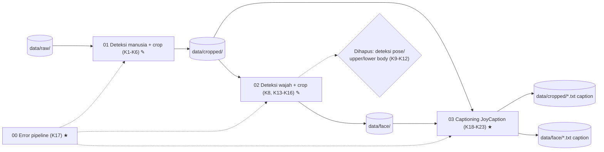

# 004a · Dev · Revisi deteksi (00–02) dan modul captioning gambar (03)

Disetujui: 2026-09-28
Produk: Deteksi Manusia, Wajah, dan Bagian Tubuh & Cropping untuk Persiapan Data Identitas · Jenis: Data pipeline · Data: tingkat 0, mode data rahasia tidak aktif
Dasar: 001, 002, 003
Dokumen terkait: docs/keputusan-produk.md

**Catatan sifat rancangan ini:** rancangan ini ditulis **retroaktif**. Perubahan pada notebook `00`–`02` dan penambahan notebook `03` sudah ada di kode branch `data-preparation` (commit `38e8f3c`, `cf864df`, `50093c8`, `b5d5bb4`, `c52d007`) sebelum sempat melalui alur usulan → persetujuan Arya yang normal. Dokumen ini mencatat kondisi kode apa adanya, dan menandai bagian yang menyimpang dari keputusan Arya sebelumnya sebagai titik periksa baru (13–15) di `docs/keputusan-produk.md`, bukan sebagai keputusan final yang sudah diratifikasi.

## Diagram alur


## Yang dirancang atau diubah
Dibanding rancangan 003 sebelumnya:

| Jenis | Bagian / keputusan | Sebelumnya | Sekarang |
|---|---|---|---|
| Baru | K17 Notebook error terpisah | Kelas error didefinisikan langsung di notebook 0/1 | `00_pipeline_errors.ipynb` berisi semua kelas error, dimuat 01/02/03 lewat `%run` |
| Diubah | K1 Ambang confidence deteksi manusia | `CONF_THRESHOLD = 0.5` | `CONF_THRESHOLD = 0.7` |
| Diubah | K2 Validasi jumlah deteksi manusia | 0 box → skip; **>1 box → di luar cakupan, skip + log peringatan** (titik periksa 1 opsi d, disetujui) | 0 box → skip; **>1 box → otomatis pilih box confidence tertinggi** — menyimpang dari keputusan yang sudah disetujui |
| Diubah | K3 Ukuran minimum crop tubuh penuh | Nilai sementara, angka tidak eksplisit di dokumen | `MIN_SIDE_PX = 256` eksplisit |
| Diubah | K4 Padding crop tubuh penuh | `PADDING_RATIO = 0.1` | `PADDING_RATIO = 0.2` |
| Diubah | K6 Struktur kode modul 001 | Kelas `HumanDetector` (OOP ringan) | Fungsi murni (`load_detector`, `detect_humans`, dll.), tanpa kelas |
| Diubah | K8 Validasi jumlah deteksi wajah | 0 wajah → skip; **>1 wajah → di luar cakupan, skip + log peringatan** | 0 wajah → skip; **>1 wajah → otomatis pilih bbox confidence tertinggi** — menyimpang dari keputusan yang sudah disetujui |
| Dihapus | K9 Deteksi pose (DWPose via `rtmlib`, GPU wajib) | Ada, direvisi di rancangan 003 | **Dihapus total** dari notebook 02 |
| Dihapus | K10 Kelompok keypoint & bbox upper/lower | Ada | **Dihapus total** |
| Dihapus | K11 Penanganan keypoint tidak lengkap | Ada | **Dihapus total** |
| Dihapus | K12 Cakupan independen per jenis (face/upper/lower) | Ada | Tidak relevan lagi — hanya wajah yang tersisa di modul 002 |
| Diubah | K13 Struktur folder output modul 002 | `data/face/`, `data/upper_body/`, `data/lower_body/` | Hanya `data/face/`; dua folder lain tidak ada lagi |
| Diubah | K14 Padding & ukuran minimum crop wajah | Reuse `PADDING_RATIO=0.1` dari K3/K4 | `PADDING_RATIO=0.7` khusus wajah (terpisah dari body), `MIN_SIDE_PX=64` tetap |
| Diubah | K15 Re-run aman modul 002 | Suffix `_face`/`_upper`/`_lower` | Hanya suffix `_face` |
| Diubah | K16 Struktur kode & nama file modul 002 | `1_face_upper_lower_body_detection_and_cropping.ipynb`, OOP-ringan, mencakup pose | `02_face_detection_and_cropping.ipynb`, fungsional, hanya wajah |
| Baru | K18 Sumber input captioning | — | `data/cropped/` (K1) dan `data/face/` (K8), dua sumber independen |
| Baru | K19 Model captioning | — | JoyCaption (`fancyfeast/llama-joycaption-beta-one-hf-llava`) via `transformers.LlavaForConditionalGeneration` |
| Baru | K20 Prompt captioning terstruktur | — | 4 bagian tetap (framing, ekspresi/gaze, fit pakaian, detail pakaian), melarang deskripsi fitur wajah permanen/tone kulit/bentuk tubuh |
| Baru | K21 Trigger word | — | `<nama>` ditambahkan idempoten di awal caption |
| Baru | K22 Batching inferensi caption | — | `CAPTION_BATCH_SIZE=2`, satu `model.generate` per batch (commit `c52d007`) |
| Baru | K23 Penyimpanan caption | — | File `.txt` bersebelahan gambar, nama sama (stem sama) |

Tidak berubah: D1, D3, D4, K5, K7.

## Rincian engineering

```
K2/K8 · Pemilihan otomatis confidence tertinggi — Menyimpang, perlu ratifikasi [kode aktual]
Pendekatan   validate_single_detection(boxes) / validate_single_face(boxes):
             return max(boxes, key=lambda b: b.confidence)
Kenapa ada   Ditemukan di kode; menggantikan aturan lama "skip & log kalau >1
             (di luar cakupan)" dari titik periksa 1 (opsi d) dan K8 yang sudah
             disetujui Arya sebelumnya
Risiko       Sama seperti opsi (b) yang DITOLAK Arya di titik periksa 1: kalau
             ada orang/wajah lain di background dengan confidence lebih tinggi
             dari subjek asli, box yang salah bisa terpilih tanpa peringatan
Status       Belum diratifikasi — lihat titik periksa 13 di keputusan-produk.md
```

```
K19 · JoyCaption VLM — Naik [S13]
Pendekatan   AutoProcessor + LlavaForConditionalGeneration, bfloat16,
             device_map="auto" (accelerate memilih device otomatis)
Parameter    temperature=0.7, max_new_tokens=150, CAPTION_BATCH_SIZE=2 (nilai
             dari kode aktual, bukan hasil kalibrasi tertulis)
Kenapa       Dipakai luas komunitas untuk captioning dataset training
             diffusion/LoRA tanpa sensor konten (S13); ditemukan sudah dipilih
             di kode, bukan hasil riset red-chan sebelum dibangun
Risiko       device_map="auto" tidak memverifikasi GPU secara eksplisit —
             beda pola dari K9 lama (GPUNotAvailableError gagal keras).
             Kalau tidak ada GPU, inferensi VLM di CPU bisa sangat lambat
             tanpa peringatan jelas — lihat titik periksa 15
Metrik       Belum ada metrik otomatis untuk kualitas caption; validasi kualitatif
             dilakukan manual oleh Arya membaca sampel caption
```

| Alternatif yang ditolak / tidak dipakai | Ditolak karena |
|---|---|
| Kembalikan K2/K8 ke aturan lama (skip kalau >1) | Belum dilakukan — kode saat ini masih memakai pemilihan otomatis; menunggu jawaban Arya (titik periksa 13) |
| Verifikasi GPU eksplisit untuk notebook 03 seperti pola K9 lama | Belum diimplementasikan di kode saat ini; diusulkan sebagai titik periksa 15 |
| Mempertahankan deteksi upper/lower body (K9-K12) | Sudah dihapus dari kode tanpa catatan alasan eksplisit; status permanen/sementara belum jelas (titik periksa 14) |

## Laporan rancangan

```
Produk: Data pipeline persiapan dataset LoRA identitas — revisi Dev + modul captioning baru
Fase: Dev
Dasar: docs/rancangan/001a, 002a, 003a
Status: menunggu jawaban (3 titik periksa baru)

Diagnosis:
Notebook 00-02 di branch data-preparation sudah direvisi di luar alur usulan->
persetujuan normal (refactor functional, pemangkasan scope pose/upper/lower,
perubahan ambang), dan notebook 03 (captioning) dibangun sebagai kemampuan baru
yang belum pernah dirancang. Dokumentasi (keputusan-produk.md, README) tertinggal
di belakang kode aktual.

Gambaran sistem: lihat diagram Mermaid di atas dan tabel "Gambaran sistem" di
docs/keputusan-produk.md (bagian teknis).

Keputusan:
Tabel Sebelumnya -> Sekarang di atas (bagian "Yang dirancang atau diubah").
Tidak berubah: D1, D3, D4, K5, K7.

Bentrokan:
- Kode K2/K8 (pilih confidence tertinggi otomatis) vs keputusan Arya yang sudah
  disetujui (titik periksa 1, K8 lama) -> dicatat sebagai titik periksa 13,
  belum final.
- README.md masih menjelaskan struktur lama (nama file, folder upper/lower,
  GPU wajib notebook 02) yang tidak lagi sesuai kode -> perlu diperbarui setelah
  titik periksa 13/14 dijawab; di luar wewenang tulis red-chan.
- Notebook 03 tidak punya penanganan error per gambar seperti pola 01/02 ->
  didorong ke Ditunda, bukan pemblokir dokumentasi ini.

Asumsi:
- Prompt captioning sengaja tidak mendeskripsikan fitur wajah permanen/bentuk
  tubuh supaya tidak "mengunci" identitas ke teks caption.
- Trigger word "<nama>" adalah placeholder yang akan diganti Arya per identitas.

Riset: 1 pencarian, dibaca dari hasil pencarian (halaman model Hugging Face +
repository GitHub resmi JoyCaption; lihat S13). Sumber dilarang yang dilewati: 0.
```

## Titik periksa dan pilihan Arya
Lihat titik periksa 13, 14, 15 di `docs/keputusan-produk.md` — **belum dijawab Arya** pada saat rancangan ini ditulis. Dicatat di sini untuk keterlacakan, disalin apa adanya:

13. [PilihBox] Kode notebook 01 dan 02 saat ini memilih otomatis box/bbox dengan confidence tertinggi ketika ada lebih dari satu deteksi — bertentangan dengan titik periksa 1 (opsi d) dan K8 lama. Ratifikasi atau kembalikan?
    a. Ratifikasi sebagai keputusan final baru (Usulan berdasarkan kode yang sudah berjalan) — dokumentasi tinggal disesuaikan, tapi mewarisi risiko opsi (b) yang dulu ditolak.
    b. Kembalikan ke aturan lama (skip & log kalau >1) — konsisten keputusan awal, perlu pink-chan ubah kode lagi.

14. [CakupanTubuh] Deteksi upper/lower body (K9-K12) sudah dihapus total dari notebook 02 — permanen atau sementara?
    a. Permanen di luar cakupan untuk saat ini (Usulan berdasarkan kode saat ini) — README dan dokumen dianggap final seperti ini.
    b. Direncanakan dibangun kembali di notebook terpisah pada rancangan berikutnya.

15. [GPUCaption] Notebook 03 memakai `device_map="auto"` tanpa verifikasi eksplisit CUDA — beda pola dari K9 lama. Kebijakannya?
    a. Ikuti pola K9 lama: verifikasi eksplisit, gagal keras kalau tidak ada GPU (Usulan, konsisten preferensi Arya di titik periksa 10).
    b. Biarkan `device_map="auto"` menangani sendiri (fallback diam-diam ke CPU kalau perlu).

## Koreksi selama putaran
Tidak ada — rancangan ini ditulis retroaktif langsung dari kode yang sudah ada di branch `data-preparation`, tanpa putaran koreksi interaktif dengan Arya. Tiga titik periksa di atas dibawa terbuka ke `docs/keputusan-produk.md` untuk dijawab Arya kapan saja.

## Perintah untuk pink-chan
pink-chan, susun rencana pembangunan dari docs/rancangan/004a_2026-09-28_dev-revisi-deteksi-dan-captioning.md — catatan: bagian K2/K8 (pemilihan confidence tertinggi) dan K9-K12 (cakupan upper/lower body) masih menunggu jawaban Arya di titik periksa 13-14; tunggu jawaban sebelum mengubah kode terkait dua hal itu. Bagian K17-K23 (notebook 00 dan 03) sudah berupa kondisi kode final yang bisa langsung dijadikan rujukan test/dokumentasi tambahan.
